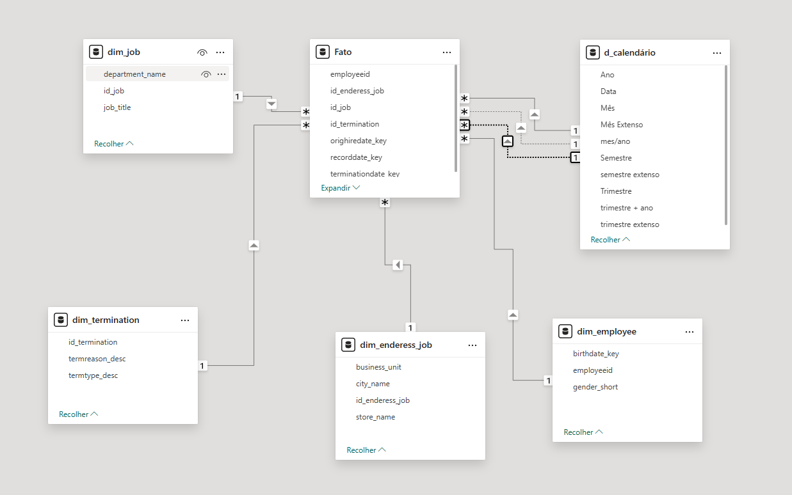
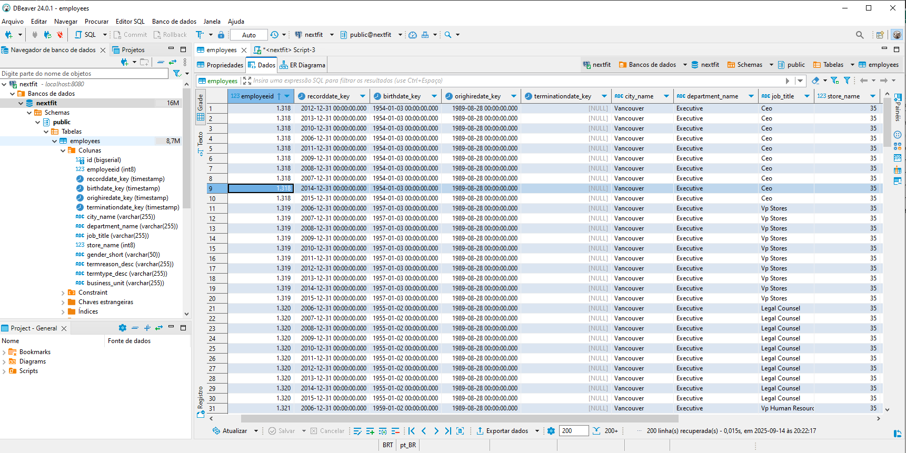

### RH analysis


(https://media.istockphoto.com/id/1467509880/pt/foto/hrm-or-human-resource-management-businessman-holding-magnifier-select-and-accept-to-manager.jpg?s=612x612&w=0&k=20&c=lVo64PIN0pEizYeAXZo7S4cPgUr4ATPY9iKlYZxy1UY=)


### Análises

    - [✓] Funcionários por cidade
    - [✓] Funcionários por idade e sexo
    - [✓] Funcionários por cargo
    - [✓] Análise Cohort
    - [✓] Admissões e demissões por ano
    - [✓] Turnover por ano


## 💻 Técnologias utilizadas
* Docker
* Python
* SQL
* PowerBI


## 🚀 Clone o projeto

Para rodar o projeto siga estas etapas:

Clone o repositorio:
```bash
  git clone https://github.com/HallanaFernandes/nextfit.git
```


Navegue ate o diretorio do repositorio:
```bash
cd nextfit
```


## Diagrama de entidades no BI



## Acesso ao banco via dbvear 



##  Testar

-   Para testar a aplicação, rode o seguinte comando para inicializar o
    serviço PostgreSQL declarado no Docker.

```sh
docker compose up -d
```

-   As credenciais do banco ficam centralizadas no docker-compose.
-   Após subir o docker, execute o arquivo python pelo jupyter.
-   Com a execução via python finalizada, você pode abrir o PowerBI.


## Observação
> É necessário ter todos os pré requisitos configurados localmente para poder executar o projeto


[⬆ Voltar ao topo](#nextfit)<br>


